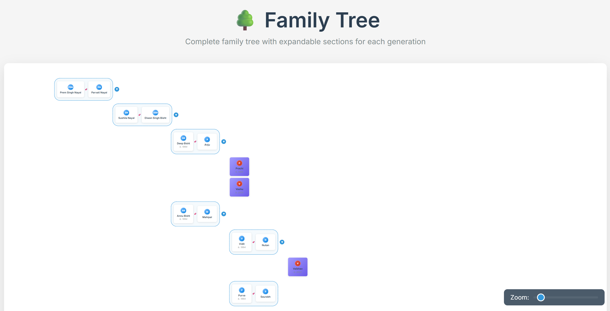

# 🌳✨ Our Awesome Family Tree ✨🌳

A super fun, interactive family tree web application built with pure HTML, CSS, and JavaScript. No special tools needed!

## ✨ Features

- **🎨 Beautiful Design**: A colorful design with smooth, happy animations.
- **👆 Interactive Cards**: Fun hover effects and pop-ups.
- **👀 Peek-a-Boo Generations**: Click to reveal new family members!
- **📱 Works Everywhere!**: Looks great on computers, tablets, and phones.
- **✏️ Your Family, Your Data**: Super easy to add your own family info.
- **🔗 Cool Connecting Lines**: See how everyone is connected.
- **🖼️ Photos or Initials**: Shows a photo, or cool initials if there's no picture.
- **🔍 Zoom In, Zoom Out!**: Look at the big picture or get up close.

## 📸 Look How Cool It Is!



## 🌐 Live Demo

You can view the live version of this project here: **[https://YogeshNayal17.github.io/Family-Tree/](https://YogeshNayal17.github.io/Family-Tree/)**

## 🚀 Let's Get Started! (It's SO Easy!)

1.  **💻 Download the files** to your computer.
2.  **🖱️ Double-click on `index.html`** to open it in your web browser.
3.  **🎉 Ta-da! You're done!** The family tree will pop up.

## 🎨 Make It YOUR Family Tree! 👨‍👩‍👧‍👦

To add your own family, just open and edit the `data.js` file with any text editor.

### 1. Add Your Family Info

In `data.js`, change the `familyData` object with your family's information.
```javascript
// In data.js
const familyData = {
    name: "Grandpa",
    spouse: "Grandma",
    image: "images/grandpa.jpg",
    birthYear: 1950,
    children: [
        {
            name: "Dad",
            spouse: "Mom",
            birthYear: 1978,
            children: [
                { name: "Me", birthYear: 2005 },
                { name: "My Sibling" }
            ]
        },
        {
            name: "Aunt",
            spouse: "Uncle",
            image: "images/aunt.jpg"
        }
    ]
};
```

### Data Structure
Each person can have:
- `name`: Required - The person's full name
- `spouse`: Optional - The person's spouse
- `children`: Optional - Array of children objects

### Adding Family Members Programmatically
You can also add family members dynamically using the console:

```javascript
// Add a new child to "Alex Doe"
familyTree.addMember("Alex Doe", { name: "New Baby Doe" });

// Refresh the display
familyTree.refresh();
```

## 🎯 How It Works

1. **Person Cards**: Each person is displayed as a beautiful card with their initials
2. **Couple Display**: Married couples are shown side-by-side with a connector line
3. **Generation Levels**: Each generation is clearly marked and can be expanded/collapsed
4. **Smooth Animations**: All interactions include smooth fade and slide animations
5. **Responsive Layout**: Automatically adjusts for different screen sizes

## 🛠️ File Structure

- `index.html` - Main HTML structure
- `styles.css` - All styling and animations
- `script.js` - JavaScript functionality and family data
- `README.md` - This documentation file

## 🌟 Browser Compatibility

Works in all modern browsers:
- Chrome ✅
- Firefox ✅
- Safari ✅
- Edge ✅

## 💡 Tips

- **Initials**: The app automatically generates initials from names
- **Photos**: You can easily add profile photos by modifying the CSS
- **Colors**: Customize the color scheme by editing the CSS variables
- **Fonts**: Change fonts by updating the Google Fonts link in HTML

## 🔧 Advanced Customization

### Adding Profile Photos
To add profile photos, modify the `createPersonCard` function in `script.js`:

```javascript
function createPersonCard(person) {
    // ... existing code ...
    
    // Add photo if available
    if (person.photo) {
        card.innerHTML = `
            
            <div class="person-name">${person.name}</div>
        `;
    }
    
    // ... rest of code ...
}
```

### Custom Colors
Modify the CSS variables in `styles.css` to change the color scheme:

```css
:root {
    --primary-color: #667eea;
    --secondary-color: #764ba2;
    --accent-color: #f093fb;
}
```

## 📱 Mobile Experience

The app is fully responsive and provides an excellent mobile experience:
- Touch-friendly buttons
- Optimized layout for small screens
- Smooth scrolling and interactions

## 🎉 Enjoy!

Your family tree is now ready! Share it with family members, customize it with your own data, and enjoy exploring your family connections.

---

*Built with ❤️ using pure HTML, CSS, and JavaScript*
